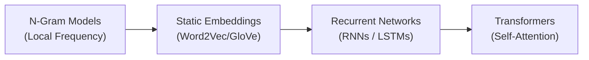
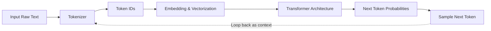
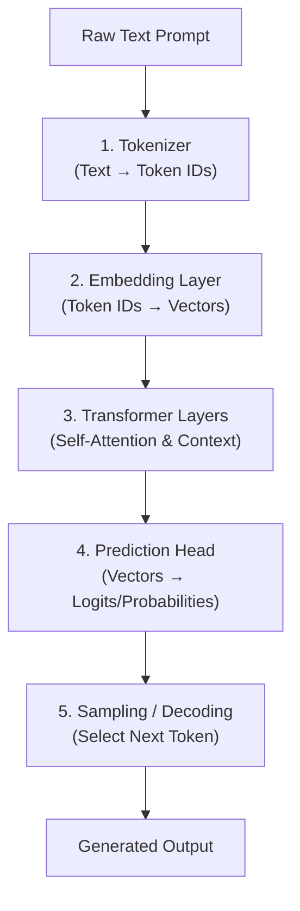

# How LLMs Are Built

A comprehensive guide for engineers on constructing, training, and optimizing large language models.  
This course covers the essential components, from data preparation and architectural design using Transformers to advanced distributed training techniques and efficient deployment strategies.  
Gain the practical knowledge required to develop sophisticated language models.

## Content

- [Chapter 01: Introduction to Large-Scale Language Modeling](#chapter-01-introduction-to-large-scale-language-modeling)

---

## Chapter 01: Introduction to Large-Scale Language Modeling

### 1. Defining Large Language Models (LLMs)

Fundamentally, a language model is a statistical tool designed to predict the probability of a sequence of words or, more accurately, tokens.  
Given a sequence of preceding tokens, the model attempts to predict the most likely next token.  

- **Core Definition:** Deep learning models trained on massive text datasets to understand, generate, and reason over natural language.
- **Fundamental Purpose:** Modeling language as a probability distribution over sequences of tokens (words or subwords):

$$P(X) = \prod_{t=1}^T P(x_t \mid x_1, x_2, \dots, x_{t-1})$$

- **Generative & Autoregressive:** LLMs generate text **one token at a time**, taking all previously generated tokens as context to predict the most likely next token.

### 2. Evolution of Language Modeling

- **Statistical Models (n-grams):** relied on simple word frequencies and local context; struggled with long sentences.
- **Static Vector Embeddings (Word2Vec / GloVe):** map words into dense numerical vectors where semantic similarity correlates with geometric distance (e.g., `king - man + woman ≈ queen`).
- **Sequential Networks (RNNs / LSTMs):** process text sequentially; however, they suffer from vanishing gradients and cannot be easily parallelized on modern hardware.
- **Transformers & Self-Attention:** process full sequences simultaneously, breaking speed and scaling bottlenecks.

### 3. High-Level Flow of an LLM

1. **Tokenization:** Text is split into standard sub-word units (tokens).
2. **Vectorization:** Tokens are mapped to high-dimensional continuous vectors.
3. **Contextual Representation:** Layers of self-attention compute relationships across all tokens in the context window.
4. **Prediction Loop:** Output logits determine the probability of every token in the vocabulary for the next slot.

1. Step 1: Tokenization: Breaks raw text into sub-word chunks (tokens) and converts them into integer IDs.
2. Step 2: Embedding: Translates integer IDs into continuous, high-dimensional vector spaces.
3. Step 3: Contextual Processing: The Transformer layers compute relationships across all tokens via Self-Attention.
4. Step 4: Output Prediction: Converts the final hidden representation into a probability score over every word in the dictionary.

### 4. Parameters and Scale

- **Parameters (Weights & Biases):** The adjustable variables modified during training to capture language structure, facts, and reasoning patterns.
- **Measuring Size:** Measured in **Millions (M)** or **Billions (B)** of parameters (e.g., 7B, 70B, 405B).
- **Scaling Laws:** Scaling up dataset size, compute, and parameter count drastically improves downstream capabilities, unlocking few-shot learning and zero-shot task execution without manual task tuning.

---
